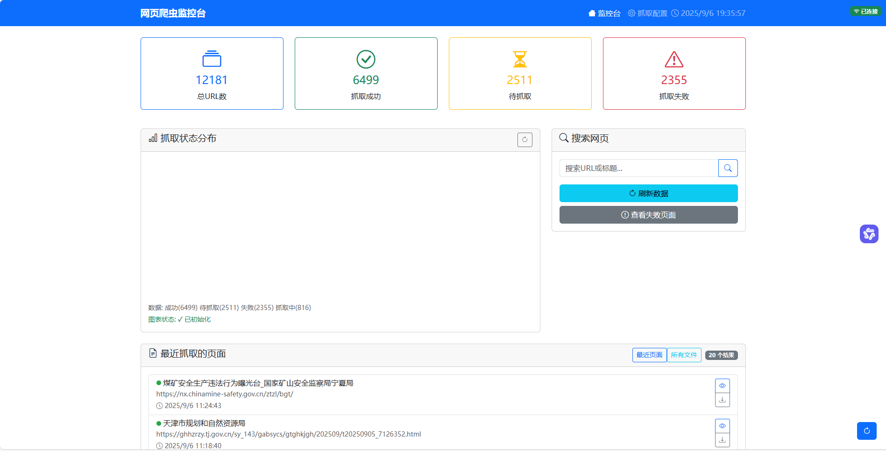
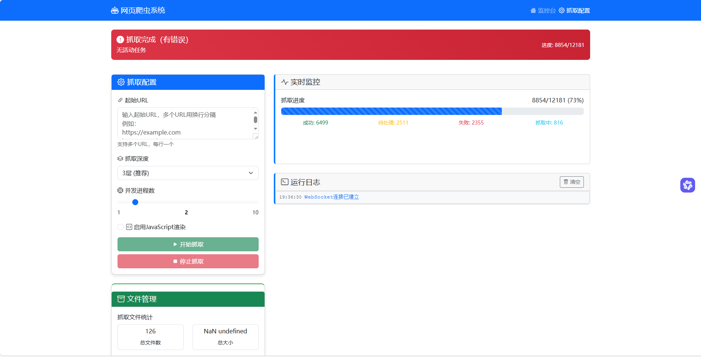

# CanCong-WebSpider 🕷️

一个现代化的智能网页爬虫系统，专为高效抓取和管理网页内容而设计。

## ✨ 主要特性

### 🚀 核心功能
- **智能抓取**：基于Scrapy框架的高性能网页抓取
- **JavaScript支持**：集成Selenium实现动态页面渲染
- **去重机制**：SQLite数据库存储URL状态，避免重复抓取
- **多进程并发**：支持1-10个worker并发抓取，提高效率
- **内容过滤**：智能关键词过滤，专注目标领域内容

### 🎯 Web监控界面
- **实时监控**：WebSocket实时推送抓取状态和进度
- **可视化仪表板**：Chart.js图表展示统计数据
- **在线配置**：Web界面配置抓取参数和启动任务
- **文件管理**：在线预览、下载和打包抓取结果
- **日志查看**：实时查看抓取日志和错误信息

### 🛠️ 内容处理
- **HTML清洗**：自动提取网页核心内容
- **Markdown转换**：HTML转Markdown格式
- **文件归档**：ZIP压缩打包抓取结果
- **重复清理**：自动清理重复文件

## 🏗️ 技术架构

```
CanCong-WebSpider/
├── webspider/              # 核心爬虫模块
│   ├── spiders/           # 爬虫实现
│   ├── middlewares.py     # 中间件
│   ├── pipelines.py       # 数据管道
│   ├── database.py        # 数据库操作
│   └── settings.py        # 配置文件
├── frontend/              # Web前端
│   ├── templates/         # HTML模板
│   ├── static/           # 静态资源
│   └── main.py           # FastAPI服务器
├── scripts/              # 工具脚本
│   ├── html_cleaner.py   # HTML清洗
│   ├── archive_webpages.py # 文件归档
│   └── clean_duplicates.py # 重复清理
├── webpages/             # 抓取结果存储
├── archives/             # 归档文件
└── mdpages/              # Markdown文件
```

## 🚀 快速开始

### 环境要求

- Python 3.8+
- Chrome/Chromium 浏览器（用于JavaScript渲染）

### 安装依赖

```bash
# 克隆项目
git clone https://github.com/shuimei/CanCong-WebSpider.git
cd CanCong-WebSpider

# 安装Python依赖
pip install -r requirements.txt
```

### 基本使用

#### 1. 命令行抓取

```bash
# 抓取单个网站
python run_spider.py https://example.com

# 多进程抓取
python run_crawler.py --url https://example.com --workers 4 --depth 3

# 启用JavaScript渲染
python run_crawler.py --url https://example.com --enable-js
```

#### 2. Web界面使用

```bash
# 启动Web监控系统
cd frontend
python main.py
```

访问 http://localhost:8000 打开监控界面

- **监控台**: 查看抓取统计和历史记录
- **抓取配置**: 在线配置和启动抓取任务

### 配置参数

| 参数 | 说明 | 默认值 |
|------|------|--------|
| `--workers` | 并发进程数 | 2 |
| `--depth` | 抓取深度 | 3 |
| `--delay` | 请求延迟(秒) | 2 |
| `--enable-js` | 启用JavaScript渲染 | False |
| `--output` | 输出目录 | webpages |

## 📊 功能演示

### Web监控界面


*实时监控抓取状态和统计数据*


*在线配置抓取参数*

### 命令行工具

```bash
# 查看抓取统计
python run_spider.py --stats

# 清理异常任务
python run_spider.py --clean

# HTML转Markdown
python scripts/html_cleaner.py

# 归档文件
python scripts/archive_webpages.py --delete --yes
```

## 🎛️ 高级配置

### 数据库配置

系统使用SQLite存储URL状态，支持自动表结构检测和兼容性处理。

### 内容过滤

在 `webspider/pipelines.py` 中配置关键词过滤规则：

```python
KEYWORDS = [
    "矿山", "地质", "自然资源", "安全监察"
    # 添加更多关键词...
]
```

### WebSocket实时通信

系统支持WebSocket实时推送：
- 抓取进度更新
- 状态变化通知
- 错误日志推送

## 📁 文件结构说明

- `webpages/`: 存储抓取的HTML文件
- `mdpages/`: 存储转换的Markdown文件
- `archives/`: 存储ZIP归档文件
- `spider_urls.db`: SQLite数据库文件

## 🔧 开发指南

### 添加新的爬虫

1. 在 `webspider/spiders/` 目录创建新爬虫文件
2. 继承 `WebSpider` 基类
3. 实现 `parse` 方法

### 自定义中间件

1. 在 `webspider/middlewares.py` 添加中间件类
2. 在 `settings.py` 中注册中间件

### 扩展数据管道

1. 在 `webspider/pipelines.py` 添加管道类
2. 实现 `process_item` 方法

## 🤝 贡献指南

欢迎提交Issue和Pull Request！

1. Fork本项目
2. 创建feature分支 (`git checkout -b feature/AmazingFeature`)
3. 提交更改 (`git commit -m 'Add some AmazingFeature'`)
4. 推送到分支 (`git push origin feature/AmazingFeature`)
5. 开启Pull Request

## 📄 开源协议

本项目采用 [MIT License](LICENSE) 开源协议。

## 🙏 致谢

- [Scrapy](https://scrapy.org/) - 强大的爬虫框架
- [FastAPI](https://fastapi.tiangolo.com/) - 现代Web框架
- [Vue.js](https://vuejs.org/) - 前端框架
- [Bootstrap](https://getbootstrap.com/) - UI组件库
- [Chart.js](https://www.chartjs.org/) - 图表库

## 📞 联系方式

如有问题或建议，请通过以下方式联系：

- GitHub Issues: [提交问题](https://github.com/shuimei/CanCong-WebSpider/issues)
- Email: [your-email@example.com]

---

⭐ 如果这个项目对你有帮助，请给个Star支持一下！