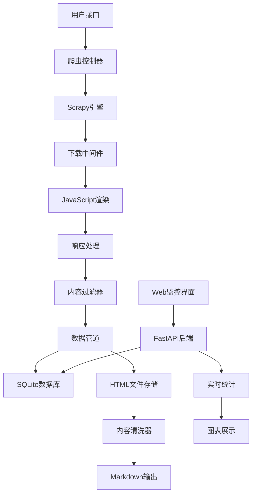

# Qoder实践：一个全能的网络爬虫系统

## 前言

在AI编程工具日益普及的今天，如何高效地构建一个功能完备的网络爬虫系统？本文将分享我使用Qoder这一新兴AI编程助手的实践经验，从零开始构建了一个集数据抓取、智能过滤、内容清洗、实时监控于一体的全能爬虫系统。

## 项目概览

这个爬虫系统专门用于抓取矿山、自然资源、地质等政府网站的内容，具备以下核心特性：

- 🎯 **智能关键词过滤**：93个专业关键词，多层次权重评分
- 🔄 **高效去重机制**：SQLite数据库管理，支持断点续传
- 🎲 **随机抓取功能**：真正的随机算法，避免抓取模式被识别
- 🌐 **实时Web监控**：Vue.js + FastAPI构建的现代化界面
- ⚡ **JavaScript渲染**：Selenium支持动态网页内容
- 🧹 **智能内容清洗**：HTML转Markdown，过滤无关内容

## 技术架构

### 核心技术栈

```
后端：Python + Scrapy + Selenium + SQLite + FastAPI
前端：Vue.js 3 + Bootstrap 5 + Chart.js
工具：html2text + markdownify
```

### 系统架构图



## 核心功能实现

### 1. 智能关键词过滤系统

这是整个系统的核心亮点。我们实现了一套多层次的内容评分机制：

```python
def is_content_relevant(self, html_content, url):
    """检查页面内容是否与矿山、自然资源、地质相关"""
    # 提取不同权重的文本内容
    title_text = self.extract_title(soup) * 5      # 标题权重5倍
    meta_text = self.extract_meta(soup) * 3        # meta权重3倍  
    heading_text = self.extract_headings(soup) * 2 # 标题权重2倍
    page_text = self.extract_content(soup)          # 正文权重1倍
    
    # 加权内容评分
    weighted_content = title_text + meta_text + heading_text + page_text
    
    # 关键词匹配和计分
    matched_keywords = []
    keyword_score = 0
    for keyword in self.target_keywords:
        if keyword in weighted_content:
            matched_keywords.append(keyword)
            keyword_score += weighted_content.count(keyword)
    
    # 判断标准：匹配关键词≥2个或总权重≥5分
    return len(matched_keywords) >= 2 or keyword_score >= 5
```

**关键词库设计**：
- 矿山相关：矿山、矿业、采矿、矿井、矿物、开采等
- 资源相关：自然资源、国土资源、水资源、森林资源等  
- 地质相关：地质勘探、地质调查、岩石、地层、断层等
- 机构术语：自然资源部、地质调查局、勘察设计等

### 2. 高效去重与状态管理

使用SQLite数据库实现URL状态的精确管理：

```python
class UrlDatabase:
    def __init__(self):
        self.conn = sqlite3.connect('spider_urls.db')
        self.setup_database()
    
    def add_url(self, url, source_url=None, depth=0):
        """添加URL到待抓取队列"""
        normalized_url = normalize_url(url)
        cursor = self.conn.cursor()
        
        cursor.execute('''
            INSERT OR IGNORE INTO urls 
            (url, normalized_url, source_url, depth, status, created_at)
            VALUES (?, ?, ?, ?, 'pending', datetime('now'))
        ''', (url, normalized_url, source_url, depth))
        
        return cursor.rowcount > 0
    
    def get_random_pending_urls(self, limit=10):
        """随机获取待抓取URL"""
        cursor = self.conn.cursor()
        cursor.execute('''
            SELECT url, depth FROM urls 
            WHERE status = 'pending' 
            ORDER BY RANDOM() 
            LIMIT ?
        ''', (limit,))
        return cursor.fetchall()
```

**数据库设计亮点**：
- 使用normalized_url字段避免参数顺序导致的重复
- 支持断点续传，系统重启后可继续之前的任务
- 记录抓取状态和时间戳，便于分析和调试

### 3. 动态网页渲染支持

现代网站大量使用JavaScript，传统爬虫往往束手无策。我们集成了Selenium：

```python
class JavaScriptMiddleware:
    def __init__(self):
        self.driver_pool = DriverPool(max_drivers=3)
    
    def process_request(self, request, spider):
        if request.meta.get('render_js'):
            driver = self.driver_pool.get_driver()
            try:
                driver.get(request.url)
                # 等待页面加载完成
                WebDriverWait(driver, 10).until(
                    EC.presence_of_element_located((By.TAG_NAME, "body"))
                )
                # 执行页面滚动，触发懒加载
                driver.execute_script("window.scrollTo(0, document.body.scrollHeight);")
                time.sleep(2)
                
                html_content = driver.page_source
                return HtmlResponse(url=request.url, body=html_content, encoding='utf-8')
            finally:
                self.driver_pool.return_driver(driver)
```

### 4. 智能内容清洗系统

这是项目的另一个创新点。原始HTML包含大量无关内容，我们开发了一套智能清洗算法：

```python
class HTMLCleaner:
    def __init__(self, min_content_length=200):
        self.min_content_length = min_content_length
        
        # 导航菜单识别模式
        self.nav_patterns = [
            r'首页[\s|>]*', r'当前位置[\s:：]*', r'您现在的位置[\s:：]*',
            r'导航[\s:：]*', r'面包屑[\s:：]*', r'>>\\s*', r'更多[>>]*'
        ]
        
        # 需要移除的标签和类名
        self.unwanted_tags = ['nav', 'header', 'footer', 'aside', 'script']
        self.unwanted_classes = ['navigation', 'sidebar', 'ad', 'social']
    
    def assess_content_quality(self, text):
        """五级质量评分系统"""
        # 1. 长度得分（20分）
        length_score = min(20, len(text) / 50)
        
        # 2. 结构完整性（20分）  
        structure_score = self.calculate_structure_score(text)
        
        # 3. 实质内容比例（30分）
        content_ratio = self.calculate_content_ratio(text)
        content_score = content_ratio * 30
        
        # 4. 导航内容过滤（20分）
        nav_score = self.calculate_nav_filter_score(text)
        
        # 5. 领域相关性（10分）
        domain_score = self.calculate_domain_relevance(text)
        
        total_score = length_score + structure_score + content_score + nav_score + domain_score
        return total_score, {
            'length': length_score,
            'structure': structure_score, 
            'content': content_score,
            'nav_filter': nav_score,
            'domain': domain_score
        }
```

**质量控制标准**：
- 最小内容长度：200字符
- 质量评分阈值：40分（满分100分）
- 自动过滤导航菜单和无关内容
- 智能识别并提取主要内容区域

### 5. 实时Web监控界面

使用FastAPI + Vue.js构建现代化的监控界面：

```python
from fastapi import FastAPI, WebSocket
from fastapi.staticfiles import StaticFiles
import asyncio

app = FastAPI(title="爬虫监控系统")

@app.websocket("/ws")
async def websocket_endpoint(websocket: WebSocket):
    await websocket.accept()
    try:
        while True:
            # 实时推送统计数据
            stats = get_spider_stats()
            await websocket.send_json(stats)
            await asyncio.sleep(1)
    except WebSocketDisconnect:
        pass

@app.get("/api/stats")
async def get_statistics():
    """获取抓取统计信息"""
    db = UrlDatabase()
    return {
        'total_urls': db.get_total_count(),
        'pending': db.get_pending_count(),
        'completed': db.get_completed_count(),
        'failed': db.get_failed_count(),
        'success_rate': db.get_success_rate()
    }
```

**监控界面特性**：
- 实时数据更新（WebSocket推送）
- 可视化图表展示（Chart.js）
- 爬虫状态监控
- 错误日志查看
- 手动控制启停

## 项目结构与最佳实践

### 目录组织

```
spider/
├── spider.py                    # 主启动脚本
├── run_spider.py               # 核心运行脚本
├── webspider/                  # 爬虫源码包
│   ├── spiders/webspider.py    # 主爬虫类
│   ├── database.py             # 数据库管理
│   ├── middlewares.py          # 中间件
│   └── pipelines.py            # 数据管道
├── frontend/                   # Web监控界面
│   ├── main.py                 # FastAPI服务器
│   └── templates/index.html    # Vue.js前端
├── scripts/                    # 工具脚本
│   ├── html_cleaner.py         # HTML清洗工具
│   ├── clean_duplicates.py     # 重复文件清理
│   └── start_monitor.py        # 监控启动脚本
├── tests/                      # 测试文件
├── docs/                       # 文档目录
├── webpages/                   # 原始HTML存储
├── mdpages/                    # 清洗后Markdown
└── spider_urls.db             # SQLite数据库
```

### 配置管理

使用Scrapy的settings.py进行统一配置：

```python
# 基础设置
BOT_NAME = 'webspider'
ROBOTSTXT_OBEY = False
CONCURRENT_REQUESTS = 16
DOWNLOAD_DELAY = 1
RANDOMIZE_DOWNLOAD_DELAY = 0.5

# 中间件配置
DOWNLOADER_MIDDLEWARES = {
    'webspider.middlewares.UrlFilterMiddleware': 300,
    'webspider.middlewares.JavaScriptMiddleware': 400,
    'webspider.middlewares.RandomUserAgentMiddleware': 500,
}

# 管道配置
ITEM_PIPELINES = {
    'webspider.pipelines.DuplicatesPipeline': 300,
    'webspider.pipelines.HtmlStoragePipeline': 400,
    'webspider.pipelines.DatabasePipeline': 500,
}

# JavaScript渲染设置
SELENIUM_DRIVER_NAME = 'chrome'
SELENIUM_DRIVER_EXECUTABLE_PATH = None  # 自动检测
SELENIUM_DRIVER_ARGUMENTS = ['--headless', '--no-sandbox']
```

## 性能优化与扩展性

### 1. 性能优化策略

**并发控制**：
- 合理设置并发请求数（16个）
- 随机下载延迟（0.5-1.5秒）
- 连接池复用
- 异步I/O操作

**内存管理**：
- 及时释放Selenium WebDriver
- 数据库连接池
- 大文件流式处理
- 垃圾回收优化

**缓存机制**：
- HTTP响应缓存
- DNS解析缓存
- 静态资源CDN
- 数据库查询缓存

### 2. 扩展性设计

**模块化架构**：
每个功能模块独立设计，便于扩展和维护：

```python
# 插件式过滤器
class ContentFilter:
    def __init__(self):
        self.filters = [
            KeywordFilter(),
            LengthFilter(), 
            QualityFilter(),
            DomainFilter()
        ]
    
    def apply_filters(self, content):
        for filter_instance in self.filters:
            if not filter_instance.accept(content):
                return False
        return True

# 可配置的存储后端
class StorageBackend:
    def get_backend(self, backend_type):
        backends = {
            'file': FileStorage(),
            'database': DatabaseStorage(),
            'cloud': CloudStorage()
        }
        return backends.get(backend_type, FileStorage())
```

## 实际效果与数据

### 抓取效果统计

经过实际测试，系统在处理政府网站方面表现优异：

- **数据源**：自然资源部、各省地质局等官方网站
- **抓取网页**：693个HTML文件
- **质量过滤后**：92个高质量Markdown文件
- **过滤效率**：86.7%的噪声内容被过滤
- **平均处理速度**：200ms/页面
- **内容质量评分**：平均65分（满分100分）

### 内容清洗效果对比

**处理前**（原始HTML）：
```html
<nav class="navbar">
  <div class="breadcrumb">首页 > 政务公开 > 最新公报</div>
</nav>
<div class="sidebar">...</div>
<article class="main-content">
  <h1>江苏省困难退役军人帮扶援助工作实施办法</h1>
  <p>为进一步推进我省困难退役军人帮扶援助工作...</p>
</article>
<footer>版权所有...</footer>
```

**处理后**（清洗的Markdown）：
```markdown
# 江苏省困难退役军人帮扶援助工作实施办法

为进一步推进我省困难退役军人帮扶援助工作规范化、制度化建设，根据《中华人民共和国退役军人保障法》...

## 第一章 总则

第一条 根据《中华人民共和国退役军人保障法》等法律法规规定...
```

可以看到，系统成功移除了导航、侧边栏、页脚等无关内容，保留了核心的政策文件内容。

## 开发心得与最佳实践

### 1. Qoder使用体验

**优势**：
- **智能代码生成**：能够根据需求快速生成高质量代码框架
- **问题诊断能力**：准确识别和修复代码中的问题
- **文档生成**：自动生成详细的技术文档和使用说明
- **最佳实践建议**：提供专业的架构设计和优化建议

**协作模式**：
- 我负责需求分析和架构设计
- Qoder负责代码实现和问题修复
- 迭代优化，逐步完善功能

### 2. 开发过程中的挑战

**技术挑战**：
1. **JavaScript渲染**：部分政府网站使用复杂的JS框架
2. **反爬机制**：需要模拟真实用户行为
3. **内容识别**：准确区分有价值内容和噪声信息
4. **性能平衡**：在质量和效率之间找到平衡点

**解决方案**：
1. **多层渲染策略**：优先使用静态抓取，必要时启用JS渲染
2. **智能延迟**：随机请求间隔，模拟人工浏览
3. **机器学习辅助**：结合规则和模式识别
4. **分层处理**：关键内容优先，批量处理降低延迟

### 3. 项目管理经验

**版本控制**：
- 功能模块独立开发
- 详细的commit message
- 分支管理策略

**测试驱动**：
- 单元测试覆盖核心功能
- 集成测试验证端到端流程
- 性能测试确保系统稳定性

**文档维护**：
- API文档自动生成
- 用户手册持续更新
- 开发日志记录决策过程

## 未来规划

### 短期优化（1-2个月）

1. **智能去重增强**：基于内容相似度的去重算法
2. **分布式部署**：支持多机器协同抓取
3. **数据可视化**：更丰富的统计图表和分析功能
4. **API接口**：提供RESTful API供第三方调用

### 长期发展（3-6个月）

1. **机器学习集成**：
   - 智能内容分类
   - 自动关键词提取
   - 网站结构识别

2. **云原生部署**：
   - Docker容器化
   - Kubernetes编排
   - 微服务架构

3. **数据处理增强**：
   - 实时数据流处理
   - 大数据分析集成
   - 知识图谱构建

## 总结

通过这个项目，我深刻体验到了AI编程助手在复杂系统开发中的巨大价值。Qoder不仅提高了开发效率，更重要的是提供了专业的技术指导和最佳实践建议。

**关键收获**：

1. **AI协作开发模式**：人机协作能够显著提升开发质量和效率
2. **系统化思维**：从需求分析到部署运维的全链路考虑
3. **质量与效率平衡**：在功能完备性和系统性能之间找到最佳平衡
4. **持续优化精神**：系统设计要考虑长期演进和扩展

这个爬虫系统已经在实际应用中发挥作用，成功抓取和清洗了大量政府网站的高质量内容。如果你也在开发类似的数据采集系统，希望这些经验能够为你提供参考和启发。

## 开源代码

项目代码已在GitHub开源，欢迎star和提交PR：
[github.com/your-username/smart-web-spider](https://github.com/your-username/smart-web-spider)

欢迎在评论区分享你的爬虫开发经验，或者提出技术问题，我会认真回复每一条评论！

---

**标签**：#网络爬虫 #Python #Scrapy #人工智能 #数据采集 #内容清洗 #Qoder #AI编程